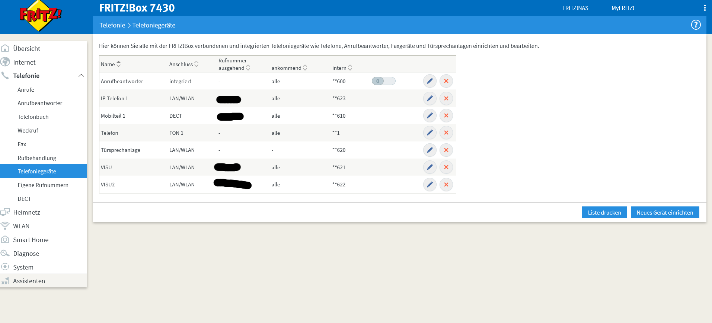
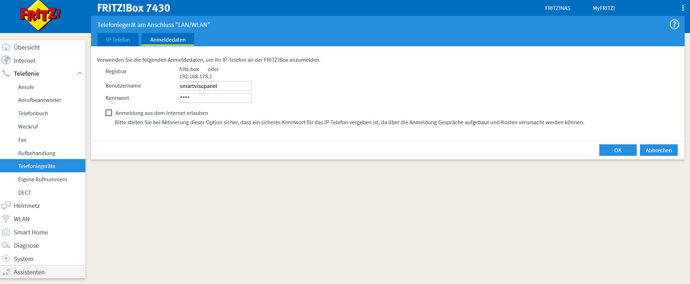
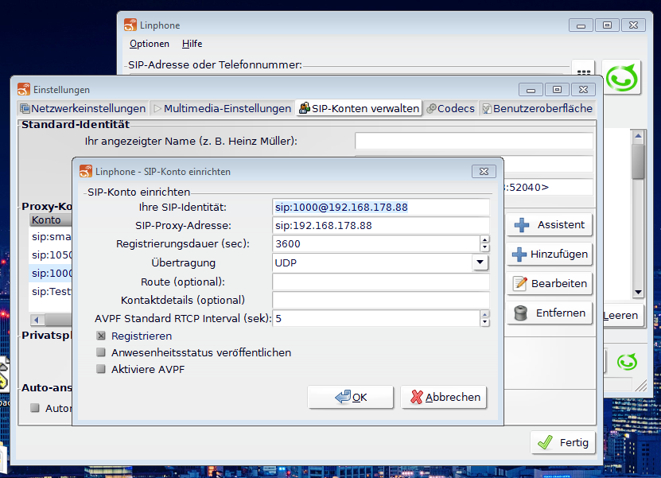

# Doorbird Plugin for *[SmarthomeNG](https://www.smarthomeng.de)*, 
based on https://pypi.org/project/DoorBirdPy/.
Its possible to make a snapshot from Live-Stream, switch the Relays1/2 or the Nightvision on and events like 
Doorbell, Motion.
So you can use this with knx or mqtt ....

It uses pynacl and chacha20-poly1305to encrypt the UDP Ethernet Pakets, which are listet in the requirements.txt file..

## Supported by the Plugin
* Make snapshots, when you want, and trigger them from other sources
* Get the images as array for visualisation with smarthomeNG
* Can save the images local (motion, doorbell, manual snapshot) 
* Get Motion/Doorbell Events from UDP Broadcasts, so you can trigger and link all actions you want with *[SmarthomeNG](https://www.smarthomeng.de)*
* So this Plugin can used, when you need a doorbird A1061 or A1081, because you can used any KNX Hardware instead

## Supported from doorbirdpy package
* get the URLs for
  * Live video request
  * Live image request
  * Open door/other relays
  * Light on
  * History image requests
  * Schedule requests
  * Favorites requests
  * Check request
  * Info request
  * RTSP

## all functions are available with *[SmarthomeNG](https://www.smarthomeng.de)* out of the box
## Tested with 
 * DoorBird D2101V
 * DoorBird D2100E


## Widget
Save widget files to "dropins"-dir of SmartVISU
		
### Widget to show saved Pictures
add this to html Page
```

{{ doorbird.doorbird_history('history', 'sprechanlage.live.snapshot_images', 'sprechanlage.live.doorbell_images', 'sprechanlage.live.motion_images', '1000', '10') }}
```		
### Widget to show Live Data
---
## Konfiguration Doorbird <SIP> Fritz.box <SIP> FREESWITCH <WebRTC> Smartvisu
### Konfiguration Fritzbox
1. Hinzufügen der Telefoniegeräte

2. Anmeldedaten der Telefoniegeräte vergeben

3. Test mit Linphone (Freier VOIP Client)



### Freeswitch 
https://freeswitch.org/confluence/ <br>
Freeswitch ist sehr sehr Umfangreich, und ist eigentllich für den Einsatz in Unternehmen als Telefonanlage gedacht. Es kann auch SIP Gespräche als Gateway WebRTC-Diensten bereitstellen, und diese Funktion brauchen wir. Somit ist es erst möglich über den Browser das Gespräch der Sprechanlage, oder interne Gespräche, zwischen 2 SmartVisu instanzen auszutauschen. 
Freeswitch nutzt also **einen** Account der Fritzbox und splittet diesen auf die konfigurierten Nummern auf.

### Zugangsdaten zum SIP SERVER (hier der Fritzbox) angeben<br>
Die Zugangsdaten des SIP-Accounts der Fritzbox im Beispiel:<br>
<em>
Name in der Fritzbox VISU, interne Nummer *622.<br>
Anmeldedaten:<br>
  Benutzername: "smartvisupanel"<br>
  Kennwort:     "passwort"<br>
</em><br>
PROXY = IP fritz.box<br>
**conf/sip_profiles/external/fritz_box.xml** <br>
```
<include>
  <gateway name="fritzbox">
    <param name="proxy" value="PROXY"/>
     <param name="register" value="true"/>
     <param name="caller-id-in-from" value="false"/> <!--Most gateways seem to want this-->
     <param name="username" value="smartvisupanel"/>
     <param name="password" value="passwort"/>
  </gateway>
</include>
```

### Allgemeine Konfigurationen der FREESWITCH Instanz
**Freeswitch/vars.xml**<br>
Default Passwort ändern!
IPFREESWITCH = ip of the freeswitch server is running [192.168.178.1]<br>
SIPSERVER =   name of the freeswitch server is running [fritz.box]<br>
SIPUSER =     User from Sip Account [smartvisupanel]<br>
SIPPASSWORD = Password of the SIP Account [passwort]<br>
IPFREESWITCH = ip of the freeswitch server is running<br>

```
  <X-PRE-PROCESS cmd="set" data="default_password=freeswitch"/>

  <X-PRE-PROCESS cmd="stun-set" data="external_rtp_ip=ipFREESWITCH"/>
  <X-PRE-PROCESS cmd="stun-set" data="external_sip_ip=ipFREESWITCH"/>
  <X-PRE-PROCESS cmd="set" data="default_provider=sip:SIPSERVER"/>
  <X-PRE-PROCESS cmd="set" data="default_provider_username=SIPUSER"/>
  <X-PRE-PROCESS cmd="set" data="default_provider_password=SIPPASSWORD"/>
  <X-PRE-PROCESS cmd="set" data="default_provider_from_domain=SIPSERVER"/>

  <!-- true or false -->
  <X-PRE-PROCESS cmd="set" data="default_provider_register=true"/>
  <X-PRE-PROCESS cmd="set" data="default_provider_contact=5000"/>

```
### Ankommende Regeln definieren
**create conf/dialplan/public/inbound_fritz.xml**<br>
Hier wird festgelegt wie sich das Gateway verhalten soll, wenn jemand an der Fritzbox die Nummer *621 anruft. Es könnten auch Wildcards genutzt werden.
Hier wird es auf die interne FREESWITCH Nummer 1000 weitergeleitet, diese wird im übernächsten Punkt editiert.
```
<!-- Beschreibt  das Gateway von extern ->  intern
<include>
  <extension name="fritzbox_call">
	<condition field="destination_number" expression="^621$">
  <action application="log" data="destination_number"/>
	<action application="export" data="RFC2822_DATE=${strftime(%a, %d %b %Y %T %z)}"/>
    <!--<condition> -->
      <action application="export" data="621 called"/>
      <variable name="both_var_name"  value="this on any direction"/>
      <action application="set" data="domain_name=$${domain}"/>
      <!-- This example maps the DID 5551212 to ring 1000 in the default context -->
      <action application="log" data="destination_number"/>
      <action application="log" data="gateway fritzbox"/>
      <action application="bridge" data="user/1000"/>
      <action application="answer"/>
    </condition>
  </extension>
</include>
```

### Abgehende Regeln definieren
**create conf/dialplan/default/fritz_box_out.xml** <br>
Sollte an den angeschlossenen Geräten gewählt werden, können folgende internen Nummern angerufen werden. Es könnten auch Wildcards genutzt werden.
Wenn an verbundenem Endgerät *610 angerufen wird, dann Routet es an die Fritzbox durch (an Nummer *610)

```
  <!-- Beschreibt  das Gateway von intern -> extern -->
    <include>
      <extension name="fritzbox_out_call">
      <condition field="destination_number" expression="^610$">
      <action application="export" data="610called"/>
      <action application="bridge" data="sofia/gateway/fritzbox/**610"/>
      <action application="answer"/>
      </condition>
      </extension>
    </include>
    <include>
    
```
### Test mit Linphone (Freier VOIP Client)


### Optional Editieren der Internen Standart-Telefonnummern
Hier können noch Namen und Benutzergruppen etc hinzugefügt werden. Die Nummern 1000-1050 sind Standartmässig vorhanden. **Diese dienen auch gleichzeitig als Benutzername zum Anmelden mit Linphone oder Smartvisu!**

**conf/directory/default/1000.xml**
```
<include>
  <user id="1000">
    <params>
      <param name="password" value="$${default_password}"/>
      <param name="vm-password" value="1000"/>
    </params>
    <variables>
      <variable name="toll_allow" value="domestic,international,local"/>
      <variable name="accountcode" value="1000"/>
      <variable name="user_context" value="default"/>
      <variable name="effective_caller_id_name" value="SmartVISU EG"/>
      <variable name="effective_caller_id_number" value="1000"/>
      <variable name="outbound_caller_id_name" value="$${outbound_caller_name}"/>
      <variable name="outbound_caller_id_number" value="$${outbound_caller_id}"/>
      <variable name="callgroup" value="techsupport"/>
    </variables>
  </user>
</include>
```
